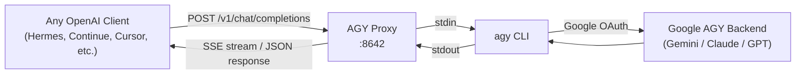

# AGY Proxy

An OpenAI-compatible API proxy for [Google Antigravity (AGY)](https://blog.google/technology/google-deepmind/antigravity-ai-coding/) CLI. Run AGY models — Gemini, Claude, GPT — through any OpenAI-compatible client.



## Features

- **OpenAI-compatible API** — Drop-in replacement for `/v1/chat/completions` and `/v1/models`
- **Streaming** — Full SSE streaming support for real-time responses
- **Tool calling** — Native OpenAI function-calling protocol support, so clients like Hermes can use their built-in tools (file editing, terminal, browser, etc.) with AGY models
- **All AGY models** — Automatically discovers available models from `agy models`
- **Cross-platform** — Works on Windows, macOS, and Linux
- **Single file** — One Python file, three dependencies

## Quick Start

### Prerequisites

- Python 3.10+
- [AGY CLI](https://blog.google/technology/google-deepmind/antigravity-ai-coding/) installed and signed in (`agy` must be in your PATH)

### Install

```bash
git clone https://github.com/Anubisx404/agy-proxy.git
cd agy-proxy
python -m venv .venv

# Windows
.venv\Scripts\activate

# macOS/Linux
source .venv/bin/activate

pip install -r requirements.txt
```

### Run

```bash
python agy_proxy.py
```

The proxy starts on `http://127.0.0.1:8642` by default.

```
2026-09-06 01:00:00 INFO [agy-proxy] Found AGY at: /usr/local/bin/agy
2026-09-06 01:00:02 INFO [agy-proxy] Available models: ['gemini-3.8-flash-high', 'gemini-3.8-flash-medium', ...]
2026-09-06 01:00:02 INFO [agy-proxy] Tool calling: enabled
2026-09-06 01:00:02 INFO [agy-proxy] Starting proxy on http://127.0.0.1:8642
```

### Options

```
python agy_proxy.py --host 0.0.0.0 --port 9000 --log-level debug
```

| Flag | Default | Description |
|---|---|---|
| `--host` | `127.0.0.1` | Bind address |
| `--port` | `8642` | Bind port |
| `--log-level` | `info` | Logging verbosity |

## API Endpoints

| Method | Path | Description |
|---|---|---|
| `GET` | `/v1/models` | List all available AGY models |
| `GET` | `/v1/models/{id}` | Get a specific model |
| `POST` | `/v1/chat/completions` | Chat completions (streaming + non-streaming) |
| `GET` | `/health` | Health check |

### Example: Chat Completion

```bash
curl http://localhost:8642/v1/chat/completions \
  -H "Content-Type: application/json" \
  -d '{
    "model": "gemini-3.8-flash-medium",
    "messages": [{"role": "user", "content": "Hello!"}],
    "stream": false
  }'
```

### Example: Streaming

```bash
curl http://localhost:8642/v1/chat/completions \
  -H "Content-Type: application/json" \
  -d '{
    "model": "gemini-3.8-flash-medium",
    "messages": [{"role": "user", "content": "Write a haiku about coding"}],
    "stream": true
  }'
```

### Example: Tool Calling

```bash
curl http://localhost:8642/v1/chat/completions \
  -H "Content-Type: application/json" \
  -d '{
    "model": "gemini-3.8-flash-medium",
    "messages": [{"role": "user", "content": "What files are in the current directory?"}],
    "tools": [{
      "type": "function",
      "function": {
        "name": "list_directory",
        "description": "List files in a directory",
        "parameters": {
          "type": "object",
          "properties": {
            "path": {"type": "string", "description": "Directory path"}
          },
          "required": ["path"]
        }
      }
    }]
  }'
```

## Using with Hermes

Add AGY as a provider in your Hermes `config.yaml`:

```yaml
providers:
  antigravity:
    api: http://127.0.0.1:8642/v1
    name: Antigravity
    api_mode: chat_completions
    default_model: gemini-3.8-flash-medium
    api_key: agy-local-proxy
    discover_models: false
    context_length: 1048576
    models:
      - gemini-3.8-flash-high
      - gemini-3.8-flash-medium
      - gemini-3.8-flash-low
      - gemini-3.7-flash-high
      - gemini-3.7-flash-medium
      - gemini-3.7-flash-low
      - gemini-3.6-flash-high
      - gemini-3.6-flash-medium
      - gemini-3.6-flash-low
      - gemini-3.1-pro-high
      - gemini-3.1-pro-low
      - claude-sonnet-4-6
      - claude-opus-4-6-thinking
      - gpt-oss-120b-medium
```

Then switch to it:

```
/model antigravity gemini-3.8-flash-medium
```

## Using with Other Clients

Any OpenAI-compatible client works. Just point the base URL to `http://127.0.0.1:8642/v1`:

**Python (openai SDK):**
```python
from openai import OpenAI

client = OpenAI(base_url="http://127.0.0.1:8642/v1", api_key="unused")
response = client.chat.completions.create(
    model="gemini-3.8-flash-medium",
    messages=[{"role": "user", "content": "Hello!"}],
)
print(response.choices[0].message.content)
```

**Continue.dev, Cody, Cursor, etc.** — set the API base to `http://127.0.0.1:8642/v1` in their provider settings.

## Environment Variables

| Variable | Description |
|---|---|
| `AGY_CLI_PATH` | Override path to `agy` binary (default: auto-detect from PATH) |
| `AGY_PROXY_CWD` | Working directory for AGY subprocess (default: user home) |

## How It Works

1. Your client sends a standard OpenAI chat completion request to the proxy
2. The proxy converts the `messages` array into a flat text prompt
3. If `tools` are provided, they're injected as structured instructions so the model knows how to call them
4. The prompt is piped via stdin to `agy --model <model> --mode plan --output-format text`
5. AGY authenticates with Google, runs the model, and returns the response
6. The proxy parses the output — extracting any tool calls if present — and returns it in OpenAI format
7. For streaming requests, stdout is read in chunks and forwarded as SSE events

### Why stdin instead of CLI arguments?

Windows has a 32,767-character limit on command-line arguments. Hermes sends full conversation history + tool schemas (often 50,000+ characters) in each request. Piping via stdin bypasses this limit entirely.

### Why `--mode plan`?

AGY is an agentic coding CLI — in its default mode it tries to use its own built-in tools. By forcing `plan` mode, the model just thinks and responds without attempting internal tool execution. The client (Hermes, etc.) handles all tool execution instead.

## Run in Background

**Windows:**
```batch
start /B pythonw agy_proxy.py --port 8642 > proxy.log 2>&1
```

**macOS/Linux:**
```bash
nohup python agy_proxy.py --port 8642 > proxy.log 2>&1 &
```

**Auto-start on Windows login** — create a `.bat` file in `shell:startup`:
```batch
@echo off
start /B "" "C:\path\to\.venv\Scripts\pythonw.exe" "C:\path\to\agy_proxy.py" --port 8642 > "C:\path\to\proxy.log" 2>&1
```

## License

MIT
